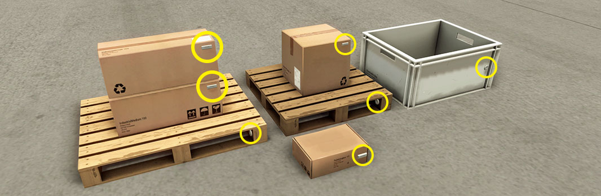
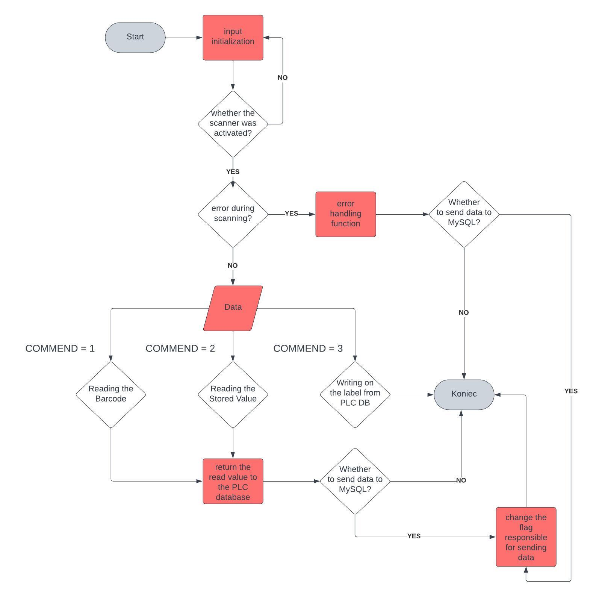
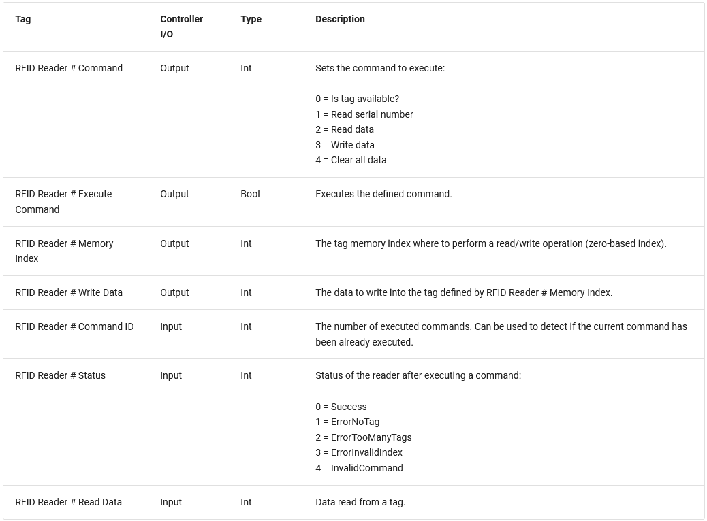

# PLC_SCL_RFID_Scanner_Control
Implementation SCL code to control RFID scanners in different cases  



<p align="left">
  <a href="https://docs.factoryio.com/manual/parts/sensors/#rfid-reader">
    <i><font color="blue" size="3">[Source]</font></i>
  </a>
</p>

# About

The RFID reader allows reading and writing data from RFID tags, using a communication model based on a single command sent by the controller. RFID tags are detected at a distance of up to 0.5 meters in front of the reader, and each reader is only able to correctly detect one tag at a time. Operation of the reader is based on executing commands, which are controlled by the corresponding tags. <br>

For the organization of data transmission and collection, two user data structures had to be created. The first structure "Scanner_Read_Data" stores the data that the program enters when the RFID tag is scanned, and the structure "Scanner_Write_Data" stores the data that will be written to the tag when it is scanned. <br>

Structures allow the relevant data to be written to a separate PLC database to which the middleware application has been connected. The databases "Scanners_db_Read" and "Scanners_db_Write", are databases that store the data read by the scanner and those that should be written to the label. <br>

Programs are fully tasted, presentation in links below: <br>
<strong> Reading_Data </strong> - https://youtu.be/bo97D2VGU4o <br>
<strong> Writing_Data </strong> - https://youtu.be/xN_iXLZe4jQ <br>

# Tools

<div align="left">
  <a href="https://www.siemens.com" target="_blank" rel="noreferrer">  </a>
  
  <a href="https://factoryio.com/" target="_blank" rel="noreferrer">  </a>
</div>
<br>
<strong> TiaPortal </strong> <br>
<strong> S7-PLCSIM Advanced </strong>

# Flow Diagram



# Docs



# Functions require appropriate calls as needed 
## Example Call 

```SCL
// Mode 1 - Barcode reading
"RFID_Reader_50"(Scanner_ID := 50,
                 Order_Scanner_ID := 0,
                 Memory_Index := 0,
                 Sent_To_SQL := false,
                 RFID_Execute_Command := "Start_Read",
                 Scanner_Executing_OFF := "Start_Read",
                 Jam_Forward := NOT "Conveyor",
                 Command_Parameter := 1,
                 RFID_Read_Data_Input := "Scanner_1_Read_Data",
                 RFID_Reader_Status := "Scanner_1_Status",
                 Scanner_Execute_Command_Output => "Scanner_1_Execute Command",
                 Scanner_WorkMode_Output => "Scanner_1_Comm_Out",
                 Recived_Data => "Scanners_db_Read".Scanner_Read[0],
                 SQL_Communication_Trigger => "Scanners_db_Read".Scanner_Read[0].Send_Data,
                 RFID_Memory_Index => "Scanner_1_MemoIDx",
                 RFID_Write_Data:= #dummy_write
);
// Mode 3 - Writing data to Label
"RFID_Reader_60"(Scanner_ID := 60,
                 Order_Scanner_ID := 0,
                 Memory_Index := 1,
                 Sent_To_SQL := True,
                 RFID_Execute_Command := "Start_Write_Scanner_1",
                 Scanner_Executing_OFF := "Start_Write_Scanner_1",
                 Jam_Forward := NOT "Conveyor",
                 Command_Parameter := 3,
                 RFID_Read_Data_Input := 0,
                 RFID_Reader_Status := "Scanner_1_Write_Status",
                 Scanner_Execute_Command_Output => "Scanner_1_Execute Command",
                 Scanner_WorkMode_Output => "Scanner_1_Command",
                 Recived_Data => #dummy_read,
                 SQL_Communication_Trigger => "Scanners_db_Write".Scanner_Write[2].Send_Data,
                 Write_Data_To_Label => "Scanner_1_Write_Data",
                 RFID_Memory_Index => "Scanner_1_Memory_Index",
                 RFID_Write_Data := "Scanners_db_Write".Scanner_Write[2]
);
// Mode 2 - Reading wrote data
"RFID_Reader_61"(Scanner_ID:=61,
                 Order_Scanner_ID:=0,
                 Memory_Index:=1,
                 Sent_To_SQL:=false,
                 RFID_Execute_Command:="Start_Read_Scanner_2",
                 Scanner_Executing_OFF:="Start_Read_Scanner_2",
                 Jam_Forward:= NOT "Conveyor",
                 Command_Parameter:= 2,
                 RFID_Read_Data_Input:="Scanner_2_Read_Data",
                 RFID_Reader_Status:= "Scanner_2_Status",
                 Scanner_Execute_Command_Output=>"Scanner_2_Execute Command",
                 Scanner_WorkMode_Output=>"Scanner_2_Command",
                 Recived_Data=>"Scanners_db_Read".Scanner_Read[2],
                 SQL_Communication_Trigger=>"Scanners_db_Read".Scanner_Read[2].Send_Data,
                 RFID_Memory_Index=>"Scanner_2_Memory_Index",
                 RFID_Write_Data:=#dummy_write);


